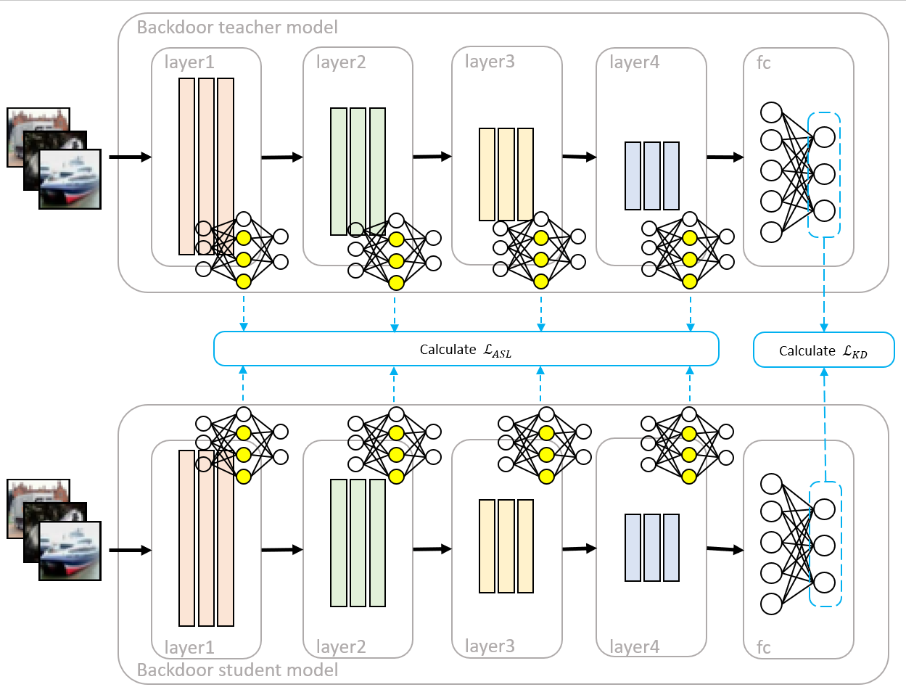

# Attention Shifting Distillation
This research studies the **defense** against [Anti-Distillation-Backdoor-Attack](https://dl.acm.org/doi/abs/10.1145/3474085.3475254) (MM '21). 
Through our proposed Attention-Shifting-Distillation, we achieved a significant decrease in the attack success rate with a moderate reduction in the model accuracy compared with [Backdoor Cleansing with Unlabeled Data](https://arxiv.org/abs/2211.12044) (CVPR '23).

## Table of Contents
* [Introduction](#introduction)
* [Attention Shifting Distillation](#asd)
* [Experiment](#results)
* [Code Description](#code-description)
* [Requirement](#requirement)
* [Commands](#command)


## Introduction<a name="introduction"></a>
**Knowledge distillation** (KD) is a well-established technique that enables the transfer of knowledge from a well-trained neural network (i.e., the teacher model) to another network (i.e., the student model), even when unlabeled data is used. 
Consequently, much research has been devoted to examining the potential risks of malicious behaviors being transferred during the KD process. 
One such malicious behavior is the **trigger backdoor attack**, in which a neural network produces incorrect outputs whenever the input contains a specific pattern (i.e., a trigger). 
**Anti-Distillation-Backdoor-Attack** (ADBA) is a study that demonstrates that trigger backdoor attacks can be transferred to the student model through their proposed training framework. 
To counter this, we propose an improved knowledge distillation method called **Attention-Shifting-Distillation** (ASD). 
This method aims to reduce the poisoning rate (i.e., attack success rate (ASR)) during KD from an ADBA model while retaining as much correct knowledge from the teacher model as possible.

## Attention Shifting Distillation<a name="asd"></a>


We proposed a backdoor defense concept by shifting the neurons used to extract features of clean images onto dormant neurons. 
These dormant neurons could be either the backdoored neurons or neurons that do not respond to the current input image. 
In the former case, the value of these neurons is reset, removing their ability to identify the trigger. However, the benign dormant neurons are also affected, impacting the model’s accuracy on its primary task. 
To compensate for these side effects, we also need to guide these shifted neurons to relearn the feature extractor again to achieve a backdoor-free yet accurate model.  

Specifically, to guide the shifting of the neurons, we design a loss function **Attention Shifting Loss** (ASL) that computes the similarity of activated neurons between two models when input with identical data. 
As for the primary task (i.e., image classification), we incorporate the well-known work **Knowledge Distillation** (KD) as another loss function to restore the compromised accuracy.

### Attention Shifting Loss
Let $l$ denote the layer we focus on, and $m^l$ represents the number of neurons on layer $l$. When the teacher model $t$ and student model $s$ are giving the same input data $x$, we denote the value of a neuron from the teacher model as $n_{m^l}^{tx}$ and the value of its corresponding neuron from the student model as $n_{m^l}^{sx}$. To achieve the goal of shifting neurons, we design our loss function with several properties:  

i) It should indicate the difference between the "state" of  $n_{m^l}^{tx}$ and $n_{m^l}^{sx}$ instead of their "value".  
ii) When $n_{m^l}^{tx}$ and $n_{m^l}^{sx}$ are both activated, the loss function should guide the $n_{m^l}^{sx}$ to become dormant.  
iii) When $n_{m^l}^{tx}$ and $n_{m^l}^{sx}$ are both dormant, the loss function should guide the $n_{m^l}^{sx}$ to become activate.  
iv) The loss function should have no effect when $n_{m^l}^{tx}$ and $n^{sx}_{m^l}$ are in different states.  

Specifically, we first preprocess through: 

$$
PP^t(n_{m^l}^{tx}\ ,\ n_{m^l}^{sx}) = n_{m^l}^{txp} = 
\begin{cases}
(sign(n_{m^l}^{sx}) - 1)(\epsilon)\ , & \text{if } n_{m^l}^{tx} = 0 \\
\frac{n_{m^l}^{tx}}{|detach(n_{m^l}^{tx})|}\ , & \text{if } n_{m^l}^{tx} \ne 0
\end{cases}
$$
$$
PP^s(n_{m^l}^{sx}) = n_{m^l}^{sxp} = 
\begin{cases}
n_{m^l}^{sx}\ , & \text{if } n_{m^l}^{sx} = 0 \\
\frac{n_{m^l}^{sx}}{|detach(n_{m^l}^{sx})|}\ , & \text{if } n_{m^l}^{sx} \ne 0
\end{cases}
$$

where $sign(k)$ returns the sign of input $k$, $\epsilon$ is a hyperparameter representing a small positive value (it is set to $1e-1$ in our defense training), $detach(k)$ indicates that we extract the value of $k$ as a constant, and $n_{m^l}^{txp},\ n_{m^l}^{sxp}$ represent the neurons after $n_{m^l}^{tx},\ n_{m^l}^{sx}$ have undergone pre-processing. 
We then evaluate the "shift" of neurons on layer $l$ between two models through the following equation:

$$
\mathcal{L}^l_{\text{ASL}}(x) = \frac{1}{m^l} \sum_{i=1}^{m^l} (1 + n_{m^l}^{txp} n_{m^l}^{sxp})^2
$$

### Attention Shifting Distillation
For **Resnet**, we primarily compute **ASL** on the neurons within the residual blocks. 
Given that the activation layer is merely a mapping process applied to its input, computing **ASL** on either the output of convolutional layers or their corresponding activation layers achieves the same result.
We opted for convolutional layer outputs due to the behavior of the ReLU activation function. 
When negative values propagate through ReLU, the resulting gradient is zero, hindering the subsequent update of dormant neurons.
While **ASL** effectively guides the desired neuronal shift, it can potentially lead to accuracy compromises if solely relied upon.
To mitigate this, we introduce **knowledge distillation** (KD) as an additional mechanism to restore the student model's ability to extract crucial features from the input data.
Let $L$ represent the set of layers where we intend to guide the neuronal shift (i.e., in Resnet, the element of $L$ is chosen in layer1 to layer4), and $\lambda$ denotes a hyperparameter that balances the importance between shifting neurons and ensuring the student model's predictions align with those of the teacher model.
The overall loss function for this framework can be expressed as:

$$
L_{\text{ASD}}(x) = \lambda \cdot L_{\text{KD}}(x) + (1-\lambda) \cdot \frac{1}{|L|} \sum_{l \in L} L^l_{\text{ASL}}(x)
$$

## Experiment<a name="results"></a>
### Dataset
In our experiments, we leverage the Cifar10 to train a Resnet18 embedded with a backdoor using the ADBA framework. 
Subsequently, we employ Cifar100 as the training data for defense mechanisms including normal **knowledge distillation** (KD), **Backdoor Cleansing with Unlabeled Data** (BCU), and our proposed **Attention Shifting Distillation** (ASD).

During the defense training, the training data size will be set to 10\%, 100\%, and 120\% of the original training set size (i.e., $5000$, $50000$, and $60000$ defense data).
To create a subset of 10\% size, we use the *random split* function provided by *Pytorch* module.
As for the 120\% size, we combine the testing set of Cifar100 which has $10000$ images with the training set of Cifar100.
After the defense process, we finally use the testing set of Cifar10 and the trigger to evaluate the defense efficacy. 

### Attack setting
Among the wide range of hyperparameter settings provided in ADBA, we select the configuration that strikes a balance between imperceptibility and attack success rate (ASR). Specifically, ADBA achieves an ASR of 0.5 on the student model after knowledge distillation, while the images containing the trigger have an average peak signal-to-noise ratio (PSNR) of 24.46 and an average structural similarity index (SSIM) of 0.84.

### Defense setting
We apply the proposed ASD on the first convolutional layer of every residual block, hence 8 layers of neurons will be compared between the teacher model and the student model (i.e., $|L|=8$).
For the $\lambda$ in the loss function, we adopt a dynamic ratio that changes with the epoch: $\lambda$ is set to $0$ for the first 10 epochs, then set to $0.9$ for the next $10$ epochs, $\lambda$ increases linearly from $0.9-1$ between epoch $20-40$, and remain $1$ after epoch $40$. 

We train the attacked (ADBA) model with ASD for 300 epochs, using SGD with a learning rate set to $1e-3$. 
When training with a larger defense dataset (i.e., $50000$ or $60000$ defense data), the learning rate will drop to $1e-4$ once the value of $L_{KD}$ reaches $1.0$.
Starting from the 50th epoch, we monitor the value of the $L_{KD}$ term and then return the accuracy (Acc) and Asr values corresponding to the minimum $L_{KD}$ as a result.

For KD, we set the temperature to $40$, and for BCU we follow the configuration in the original paper.

### Result
We repeated each experiment seven times, removed the experiments with the highest and lowest value of Acc, and then reported the average of the remaining five runs in the following tables.

<table>
  <thead>
    <tr>
      <th colspan="2">Defense Dataset (images)</th>
      <th colspan="3">5000</th>
      <th colspan="3">50000</th>
      <th>60000</th>
    </tr>
    <tr>
      <th>Training Framework</th>
      <th>ADBA</th>
      <th>KD</th>
      <th>ASD</th>
      <th>BCU</th>
      <th>KD</th>
      <th>ASD</th>
      <th>BCU</th>
      <th>ASD</th>
    </tr>
  </thead>
  <tbody>
    <tr>
      <td>Acc</td>
      <td align='center'>0.91</td>
      <td align='center'>0.74</td>
      <td align='center'>0.46</td>
      <td align='center'>0.87</td>
      <td align='center'>0.88</td>
      <td align='center'>0.65</td>
      <td align='center'>0.9</td>
      <td align='center'>0.7</td>
    </tr>
    <tr>
      <td>Asr</td>
      <td align='center'>1.0</td>
      <td align='center'>0.53</td>
      <td align='center'>0.18</td>
      <td align='center'>0.86</td>
      <td align='center'>0.98</td>
      <td align='center'>0.21</td>
      <td align='center'>0.97</td>
      <td align='center'>0.29</td>
    </tr>
  </tbody>
</table>

The experiment shows that ASD can decrease 78.8% of Asr with the cost of a 25.6% decrease on Acc. 
Moreover, ASD is the only framework among three methods utilizing unlabeled OOD data that exhibits a trend of Asr suppression.
While ASD demonstrably reduces the Asr, the recovered Acc remains lower than other methods. 
This suggests the potential over-shifting of neurons, hindering the recovery process. 
Future research should focus on optimizing the process of selecting and shifting neurons to achieve a better balance between Asr suppression and Acc recovery. 
Determining the optimal number and specific neurons to shift will be crucial for further enhancing ASD’s effectiveness.

## Code Description<a name="code-description"></a>
*   **`distri.py`:**  The main implement of Attention-Shifting-Distillation.
*   **`distri_dsextend.py`:** The version extends the training set from 50000 to 60000.
*   **`helper/utils.py`:** Helper functions.

## Requirement<a name="requirement"></a>
Please follow [ADBA](https://github.com/brcarry/ADBA) to set up the environment.

Note: The configuration we train ADBA in the experiment is listed below:
|Hyperparameter|Epoch|Alpha_Backdoor|Beta_Backdoor|Target_Label_Backdoor|
|---|:---:|:---:|:---:|:---:|
|Value|100|0.4|0.3|0|

We also modified two lines of code in `main.py`.
For line 127, we changed from
```python
loss_optimize_trigger = loss_optimize_trigger_0 + loss_optimize_trigger_1 + args.miu*torch.norm(mask, p=2)
```
to
```python
loss_optimize_trigger = loss_optimize_trigger_0 + loss_optimize_trigger_1 + args.miu*torch.norm(mask, p=1)
```
For line 135, we change from
```python
 mask.clamp_(0, 1)
```
to
```python
 mask.clamp_(0, 0.3)
```
This is the key to a better PSNR and SSIM. 
As for those hyperparameters we didn't mention, we followed the default setting in the repo.

## Commands<a name="command"></a>
To run the code for Attention-Shifting-Distillation (ASD), first, assign the directory of your trained ADBA (it should contain a checkpoint of the model and pattern, mask for the trigger):
```python
read_dir = f'**your directory**'
```
Then testing ASD against ADBA:
```python
python distri.py
```
To test ASD with a larger dataset (specifically, using both training set (50000) and testing set (10000) of Cifar100 as training set):
```python
python distri_dsextend.py
```

As Knowledge Distillation (KD) is also part of our ASD, you can simply test KD against ADBA by running: 
```python
python distri.py --ratio_type fix 
```
This will train the ADBA model with a default ratio between two loss functions: 1 * KD + 0 * ASL.

To test [Backdoor Cleansing with Unlabeled Data](https://github.com/luluppang/BCU) against ADBA, please check their repo. for details.

